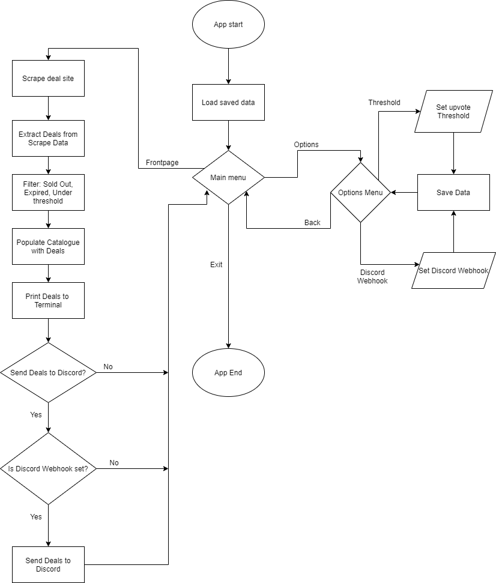
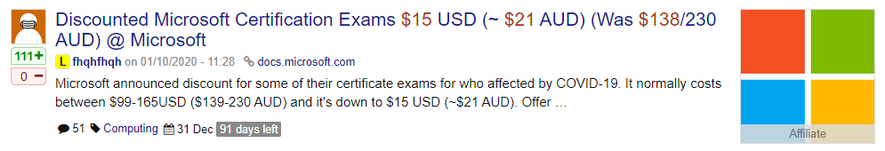
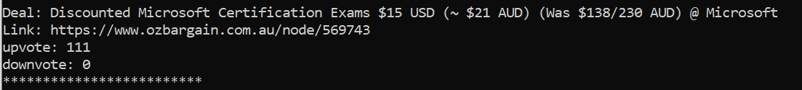
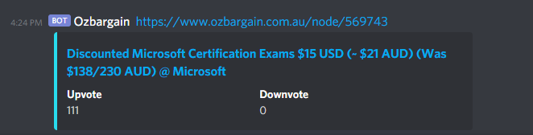

## **Harry Tran T2A3**

[Github Repo](https://github.com/HarryTranAU/HarryTran_T2A3)

[Trello Project Management](https://trello.com/b/b249dqpt/api-ci-cd-terminal-app)


# Summary

[Ozbargain](https://www.ozbargain.com.au/) is a popular deal site where site members post deals they have come across. This program will scrape the frontpage using Beautiful Soup for active deals (not "out of stock" or "expired") and print them to the terminal. Optional: the output can also be sent to a Discord Server via Discord Webhook.

# Features

 - Scrape frontpage(www.ozbargain.com.au) to Discord channel
 - Filter deals by upvotes (options > change threshold)
 - Connect discord webhook to program
 - Save/load configurations (webhook and threshold persistent through sessions)

### Input

**`Beautiful Soup`**

Beautiful Soup is a python library used to pull data out of HTML/XML. Beautiful Soup pairs with a parser like `lxml` to packaged the data nicely in a `BeautifulSoup` object. The `BeautifulSoup` object significantly simplifies the process of finding strings and tags in the HTML document using methods such as `find()` and `find_all()`.

**`Terminal: User Input`**

The program will take input from the user to determine an upvote threshold (default=0) and the discord webhook. Menu navigation will also require user input.

### Output

**`Discord webhooks`**

Discord's builtin Webhooks function as an easy way to get automated messages and data updates sent to a text channel in a server. The program will interact with the webhook through the `dhooks-lite` python module.

**`Terminal: Output`**

The program will output the deals to the terminal. An example is shown in the screenshots section.

### CI/CD

`Github Actions` was used to automate the workflow.

`AWS EC2` was used for deployment

# Dependencies

**Requests**

Requests used to retrieve the text from the website.

```
certifi==2020.6.20
chardet==3.0.4
idna==2.10
requests==2.24.0pip
urllib3==1.25.10
```

**Beautiful Soup and lxml**

Beautiful Soup and lxml used to parse and extract data from the retrieved website.

```
beautifulsoup4==4.9.1
soupsieve==2.0.1
lxml==4.5.2
```

**JSON**

JSON module used for saving and loading data.

**RE**

Regex used to validate the webhook url

**Time**

`Sleep()` function is used to space requests to prevent flooding api with requests too quickly.

**dhooks-lite**

Dhooks-lite used to interact with Discord webhook

```
dhooks-lite==0.5.0
```

**flake8**

Flake8 used to conform with style guide.

```
flake8==3.8.3
mccabe==0.6.1
pycodestyle==2.6.0
pyflakes==2.2.0
```

# Structure

**Deal**

The Deal class contains the `title`, `link`, `upvote`, and `downvote` of each deal shown on the website.

**Catalogue**

The Catalogue class contains a list of deals and methods used to `extract_deals` from the html text, and `populate_catalogue`.

**Ozbargain**

The Ozbargain class is used to group scraping functions for the website `https://www.ozbargain.com.au/`.

**Data**

The Data class is used to group functions for saving and loading data from save files.

**Bot**

The Bot class is used to group functions for interaction with Discord webhooks.

# Flowchart



# Screenshots

**Deal on Ozbargain**




**Terminal Output**




**Discord Output**



# Installation (Linux)

Install Python and git
```
sudo apt-get update
sudo apt-get install git
sudo apt-get install python3
```

Git clone and Open Folder
```
git clone https://github.com/HarryTranAU/HarryTran_T2A3.git
cd HarryTran_T2A3
```

Optional: Virtual Environment (Recommended)

```
sudo apt-get install python3-venv
python3 -m venv venv
source venv/bin/activate
```

Install Pip/requirements
```
sudo apt-get install python3-pip
pip install -r requirements.txt
```

Program Start
```
python main.py
```

# Discord/Webhook Guide

[1. Discord Download](https://discord.com/download)

[2. How to create a Discord Server (howtogeek.com)](https://www.howtogeek.com/318890/how-to-set-up-your-own-discord-chat-server/#:~:text=To%20create%20your%20own%20server,a%20Server%E2%80%9D%20on%20the%20left.)

[3. Creating a Webhook on your Server](https://support.discord.com/hc/en-us/articles/228383668-Intro-to-Webhooks#:~:text=Choose%20the%20repository%20that%20you,the%20%22Payload%20URL%22%20blank.)

Note: the webhook should be in the form of `https://discord.com/api/webhooks/{id}/{token}`

# Version History

### `NEXT UPDATE: Saving deals sent to Discord (Prevent Duplicates)`

Version goal: remembering which deals have been sent to discord to only send new deals when the program has run.

To be implemented:
 - deals.JSON to save sent deals
 - function to find the difference between scraped deals and known deals

### `Version 0.5: Discord Output`

Version goal: Output Deals to a discord server

To be implemented:
 - Discord webhook
 - Saving discord url
 - Discord message formatting/embed

### `Version 0.4: User Options`

Version goal: Allow user to set upvote threshold.

To be implemented:
 - Add options to Menu
 - Save options to file

### `Version 0.3: Filters`

Version goal: Filter out expired deals

To be implemented:
 - Changes to how catalogue is populated

### `Version 0.2: User Interface`

Version goal: Create interface for user interaction and choices.

To be implemented:
 - Menu

### `Version 0.1: Foundation`

Version goal: Implement web scraper for site 1 (ozbargain.com.au) and output to terminal.

To be implemented:
 - Entry point
 - Scraper
 - Deal
 - Catalogue
